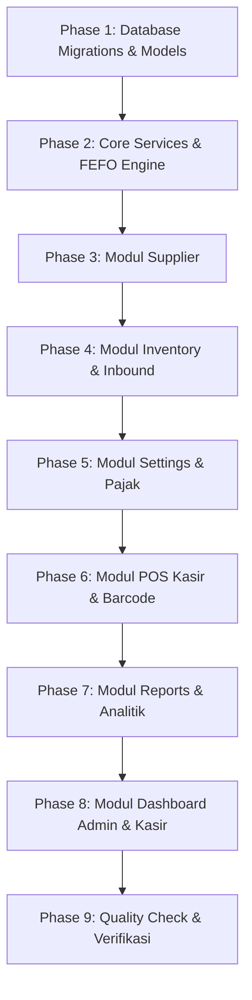

# AI Development & Task Execution Guide — POS Apotek

Panduan ini adalah acuan kerja berurutan (**Step-by-Step AI Execution Order**) bagi AI Agent atau pengembang untuk mengimplementasikan seluruh fitur **POS Apotek** secara sistematis, teruji, dan tanpa menimbulkan konflik dependensi.

---

## 🗺️ Urutan Eksekusi Task (Execution Roadmap)



---

## 📋 Rincian Langkah Eksekusi per Fase

### 🔹 Phase 1: Database Migrations, Models, & Seeders
> **Tujuan**: Membangun fondasi database relasional yang lengkap sesuai [DATABASE_SCHEMA.md](./DATABASE_SCHEMA.md).

1. **Buat Migrasi Tabel**:
   - `suppliers`: `id`, `name`, `phone`, `timestamps`
   - `products`: `id`, `barcode` (nullable, unique), `name`, `base_unit_name`, `timestamps`
   - `product_units`: `id`, `product_id` (FK), `unit_name`, `multiplier`, `selling_price`, `timestamps`
   - `product_batches`: `id`, `product_id` (FK), `supplier_id` (FK), `batch_number` (nullable), `base_qty`, `expiry_date`, `cost_per_base_unit`, `timestamps`
   - `settings`: `id`, `key` (unique), `value`, `timestamps` (untuk `tax_percentage`, `store_name`, dll)
   - `sales`: `id`, `invoice_number` (unique), `user_id` (FK), `total_revenue`, `total_cogs`, `tax_amount`, `payment_method`, `paid_amount`, `change_amount`, `timestamps`
   - `sale_items`: `id`, `sale_id` (FK), `product_id` (FK), `unit_id` (FK), `qty`, `total_price`, `total_cogs`, `timestamps`
2. **Buat Model Eloquent & Relasi**:
   - `App\Models\Supplier`: `hasMany(ProductBatch::class)`
   - `App\Models\Product`: `hasMany(ProductUnit::class)`, `hasMany(ProductBatch::class)`, `hasMany(SaleItem::class)`
   - `App\Models\ProductUnit`: `belongsTo(Product::class)`
   - `App\Models\ProductBatch`: `belongsTo(Product::class)`, `belongsTo(Supplier::class)`
   - `App\Models\Sale`: `belongsTo(User::class)`, `hasMany(SaleItem::class)`
   - `App\Models\SaleItem`: `belongsTo(Sale::class)`, `belongsTo(Product::class)`, `belongsTo(ProductUnit::class)`
   - `App\Models\Setting`
3. **Buat Sample Seeders**:
   - Seeder dummy untuk Supplier PBF, Produk Obat (misal: Paracetamol, Amoxicillin, Antasida, Vitamin C), Satuan (Box, Strip, Tablet), dan Batch stok awal untuk testing.

---

### 🔹 Phase 2: Core Domain Services
> **Tujuan**: Mengisolasi kalkulasi bisnis apotek ke Service Layer sebelum membuat Controller dan UI.

1. `App\Services\FefoStockService`:
   - Algoritma seleksi dan pemotongan stok batch terdekat expired (`expiry_date ASC`) + perhitungan COGS.
2. `App\Services\SettingService`:
   - Pengambilan dan pembaruan konfigurasi persentase pajak aktif (`tax_percentage`).

---

### 🔹 Phase 3: Modul Supplier (`docs/features/03_supplier.md`)
> **Tujuan**: Menyediakan data supplier sebelum proses penerimaan barang di Inventory.

1. **Backend**:
   - `App\Http\Controllers\Admin\SupplierController`: `index`, `store`, `show` (detail & riwayat pasokan), `update`, `destroy`.
   - `App\Services\SupplierService`: 3 KPI Cards (Total SKU, Total Spend, Last Order Date).
2. **Frontend UI**:
   - Halaman `resources/js/pages/admin/suppliers/index.tsx`: 3 Summary Cards, Tabel Supplier, Modal Tambah/Edit.
   - Halaman `resources/js/pages/admin/suppliers/show.tsx`: Profil supplier, mini statistik, dan tabel riwayat batch masuk.

---

### 🔹 Phase 4: Modul Inventory & Inbound (`docs/features/02_inventory.md`)
> **Tujuan**: Manajemen master obat, barcode/QR, dan pencatatan penerimaan stok batch wajib pilih supplier.

1. **Backend**:
   - `App\Http\Controllers\Admin\InventoryController`: `index`, `store` (create product + initial batch), `show` (detail barang & supplier asal), `adjust` (inbound batch baru).
   - `App\Services\InventoryService`: 3 Summary Cards, kalkulasi total base qty & nilai aset.
2. **Frontend UI**:
   - Halaman `resources/js/pages/admin/inventory/index.tsx`:
     - 3 Summary Cards.
     - **Tab 1**: Daftar Barang (tampilan QR/Barcode, satuan bertingkat, sisa stok, status).
     - **Tab 2**: Riwayat Transaksi Keluar-Masuk (Inbound vs Outbound log).
     - Modal Tambah Produk (Wajib input supplier).
   - Modal / Halaman Detail Barang: Tampilan QR Code, daftar pasokan supplier asal, dan riwayat mutasi produk.

---

### 🔹 Phase 5: Modul Settings & Kasir Performance (`docs/features/06_settings.md`)
> **Tujuan**: Konfigurasi pajak apotek dan manajemen kasir sebelum mengoperasikan POS.

1. **Backend**:
   - `App\Http\Controllers\Admin\SettingController`: `index`, `storeUser` (buat kasir baru), `updateTax` (persentase pajak).
   - `App\Services\SettingService`: Agregasi metrik performa kasir (Total Transaksi, Total Omzet, AOV).
2. **Frontend UI**:
   - Halaman `resources/js/pages/admin/settings/users.tsx`: Tabel Users, Modal Buat Kasir Baru, Tabel Metrik Performa Kasir.
   - Halaman `resources/js/pages/admin/settings/tax.tsx`: Input persentase pajak dengan toggle aktif.

---

### 🔹 Phase 6: Modul POS & Barcode Kasir (`docs/features/04_pos.md`)
> **Tujuan**: Antarmuka kasir cepat dengan scan barcode, pilihan satuan dinamis (Box/Strip/Tablet), auto-tax, FEFO deduction, dan cetak struk.

1. **Backend**:
   - `App\Http\Controllers\PosController`: `index`, `barcodeSearch`, `checkout`.
   - `App\Services\PosSaleService`: Validasi stok, auto-tax calculation dari settings, FEFO stock reduction, pencatatan `sales` & `sale_items`.
2. **Frontend UI**:
   - Halaman `resources/js/pages/cashier/dashboard.tsx` atau `pos/index.tsx`:
     - Barcode scanner input (auto-focus, instant cart add).
     - Keranjang belanja dengan dropdown satuan jual dinamis (`product_units`) & auto re-calculate subtotal.
     - Panel checkout: Grand Total, Tax %, Uang Diterima, Kembalian, Tombol Pecahan Cepat.
     - Modal Cetak Struk Kasir Thermal (58mm / 80mm).

---

### 🔹 Phase 7: Modul Reports & Analitik Finansial (`docs/features/05_reports.md`)
> **Tujuan**: Analisis omzet, COGS, pajak, laba bersih, filter multi-parameter, serta laporan esensial apotek (Expired Risk, Fast/Slow Moving, Inventory Valuation, Supplier Summary).

1. **Backend**:
   - `App\Http\Controllers\Admin\ReportController`: `index`, `exportExcel`, `exportPdf`.
   - `App\Services\ReportService`: 
     - 3 Cards Finansial (Revenue, COGS, Net Profit dengan Tax).
     - Chart Revenue vs COGS.
     - Laporan Risiko Kedaluwarsa & Potensi Kerugian.
     - Laporan Fast-Moving vs Slow-Moving.
     - Laporan Nilai Aset Stok Inventori.
     - Rekapitulasi Pengadaan per Supplier.
     - Filter DTO (`start_date`, `end_date`, `product_id`, `supplier_id`, `user_id`, `payment_method`).
2. **Frontend UI**:
   - Halaman `resources/js/pages/admin/reports/index.tsx`:
     - **Panel Filter Komprehensif** (Date Range, Produk, Supplier, Kasir, Metode Bayar).
     - **Tab 1: Finansial & Penjualan** (3 Summary Cards, Chart Revenue vs COGS, Tabel Transaksi + Footer Total).
     - **Tab 2: Risiko Kedaluwarsa** (Batch Expired / Near Expired + Potensi Rugi Finansial).
     - **Tab 3: Fast vs Slow Moving** (Top 20 Obat Terlaris & Dead Stock).
     - **Tab 4: Nilai Aset Inventori** (Total Modal Tertanam di Rak).
     - **Tab 5: Rekap Supplier** (Total Belanja & Pasokan per PBF).
     - Tombol Ekspor Excel & Cetak PDF di setiap tab.

---

### 🔹 Phase 8: Modul Dashboard Admin & Kasir (`docs/features/01_dashboard.md`)
> **Tujuan**: Tampilan utama operasional yang merangkum data dari seluruh modul yang sudah aktif.

1. **Backend**:
   - `App\Http\Controllers\Admin\DashboardController`: `index`.
   - `App\Services\DashboardService`: 4 Summary Cards, Chart tren penjualan, Quick Actions, Recent Transactions, System Status.
2. **Frontend UI**:
   - Halaman `resources/js/pages/admin/dashboard.tsx`:
     - 4 Summary Cards (Revenue, Transaksi, Laba Kotor, Alert Expired/Stok).
     - Financial Overview Chart.
     - Quick Actions Shortcuts.
     - Recent Transactions Real-time.
     - System Status Widget.

---

### 🔹 Phase 9: Quality Check & Verifikasi Akhir
1. **TypeScript Type Safety**:
   ```bash
   npm run types:check
   ```
2. **PHP Code Style & Linting**:
   ```bash
   composer run lint
   ```
3. **Automated Testing**:
   ```bash
   php artisan test
   ```
4. **Verifikasi Alur End-to-End**:
   - Inbound barang dari Supplier A -> Stok bertambah di Inventory -> Kasir menjual via POS -> Stok terpotong FEFO -> Terbaca di Reports & Dashboard.

---

## 📌 Aturan Wajib bagi AI Agent saat Bekerja
1. **Komponen Reusable (Reusable Components First)**:
   - Utamakan pembuatan komponen modular di `resources/js/components/` (summary card, data table, modal dialog, search input, filter bar, badge status). Hindari duplikasi markup/styling antar halaman.
2. **Konsistensi Warna (Strict Theme Tokens)**:
   - Gunakan HANYA 4 token warna resmi dari `app.css`:
     - `primary` (`#0d9488` Teal)
     - `secondary` (`#10b981` Emerald)
     - `tertiary` (`#64748b` Slate)
     - `neutral` (`#f8fafc` Slate 50)
   - Jangan menggunakan warna heksadesimal baru di luar tokens ini.
3. **Responsif di Semua Menu**:
   - Seluruh halaman wajib responsif dan nyaman digunakan di Desktop, Tablet, dan Mobile.
4. **Navigasi Mobile Menggunakan Bottom Bar (`AppBottomBar`)**:
   - Di mobile (`< md`), Sidebar desktop tersembunyi dan **wajib digantikan oleh Bottom Bar (`AppBottomBar`)**.
   - Selalu gunakan layout wrapper `<AppSidebarLayout>` yang sudah memiliki padding bawah `pb-20 md:pb-0`.
5. **Clean Architecture & Transactions**:
   - Gunakan `DB::transaction()` untuk semua mutasi data multi-tabel (stok & penjualan).
   - Jalankan `composer run lint` dan `npm run types:check` pada setiap penyelesaian fitur.
