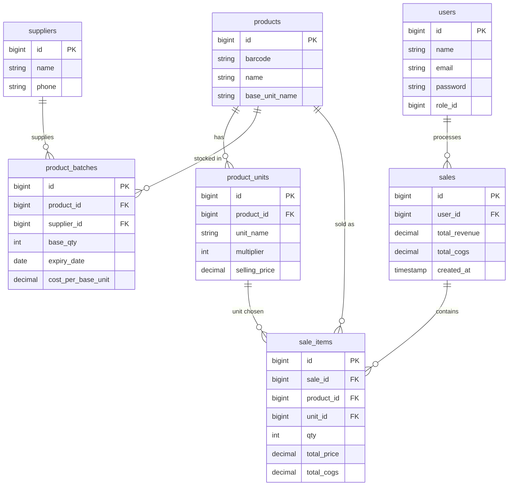

# Database Schema Specification — POS Apotek

Dokumen ini memetakan skema database utama yang dirancang, relasi antar tabel, serta usulan penyesuaian (*suggested adjustments*) untuk direview.

---

## 1. Skema Tabel Utama (Existing Design)

### 1. `users`
Menyimpan data pengguna sistem (Admin & Kasir).
```sql
users {
    id                  BIGINT UNSIGNED AUTO_INCREMENT PRIMARY KEY,
    name                VARCHAR(255) NOT NULL,
    email               VARCHAR(255) NOT NULL UNIQUE,       -- atau username
    password            VARCHAR(255) NOT NULL,
    role_id             BIGINT UNSIGNED NOT NULL,           -- relasi ke roles (admin / cashier)
    created_at          TIMESTAMP NULL,
    updated_at          TIMESTAMP NULL
}
```

### 2. `suppliers`
Menyimpan data pemasok / distributor obat.
```sql
suppliers {
    id                  BIGINT UNSIGNED AUTO_INCREMENT PRIMARY KEY,
    name                VARCHAR(255) NOT NULL,
    phone               VARCHAR(50) NULL,
    created_at          TIMESTAMP NULL,
    updated_at          TIMESTAMP NULL
}
```

### 3. `products`
Menyimpan data master obat/produk dengan satuan dasar (*base unit*).
```sql
products {
    id                  BIGINT UNSIGNED AUTO_INCREMENT PRIMARY KEY,
    barcode             VARCHAR(100) NULL UNIQUE,
    name                VARCHAR(255) NOT NULL,
    base_unit_name      VARCHAR(50) NOT NULL,               -- contoh: 'tablet', 'kapsul', 'botol', 'pcs'
    created_at          TIMESTAMP NULL,
    updated_at          TIMESTAMP NULL
}
```

### 4. `product_units`
Menyimpan variasi satuan jual produk dan faktor pengali ke satuan dasar (*multiplier*).
```sql
product_units {
    id                  BIGINT UNSIGNED AUTO_INCREMENT PRIMARY KEY,
    product_id          BIGINT UNSIGNED NOT NULL,           -- FK -> products.id
    unit_name           VARCHAR(50) NOT NULL,               -- contoh: 'strip', 'box'
    multiplier          INT NOT NULL DEFAULT 1,             -- contoh: 1 strip = 10 tablet (multiplier = 10)
    selling_price       DECIMAL(15, 2) NOT NULL,            -- harga jual per unit ini
    created_at          TIMESTAMP NULL,
    updated_at          TIMESTAMP NULL
}
```

### 5. `product_batches`
Menyimpan stok barang masuk per batch, tanggal kedaluwarsa, dan HPP beli per base unit.
```sql
product_batches {
    id                  BIGINT UNSIGNED AUTO_INCREMENT PRIMARY KEY,
    product_id          BIGINT UNSIGNED NOT NULL,           -- FK -> products.id
    supplier_id         BIGINT UNSIGNED NOT NULL,           -- FK -> suppliers.id
    base_qty            INT NOT NULL DEFAULT 0,             -- stok tersisa dalam satuan dasar (base unit)
    expiry_date         DATE NOT NULL,                      -- tanggal kadaluarsa untuk FEFO
    cost_per_base_unit  DECIMAL(15, 2) NOT NULL,            -- harga beli (COGS) per satuan dasar
    created_at          TIMESTAMP NULL,
    updated_at          TIMESTAMP NULL
}
```

### 6. `sales`
Menyimpan header transaksi penjualan di kasir.
```sql
sales {
    id                  BIGINT UNSIGNED AUTO_INCREMENT PRIMARY KEY,
    user_id             BIGINT UNSIGNED NOT NULL,           -- FK -> users.id (kasir yang melayani)
    total_revenue       DECIMAL(15, 2) NOT NULL,            -- total nominal penjualan kotor
    total_cogs          DECIMAL(15, 2) NOT NULL,            -- total HPP (modal barang yang terjual)
    created_at          TIMESTAMP NULL,
    updated_at          TIMESTAMP NULL
}
```

### 7. `sale_items`
Menyimpan rincian item barang yang terjual per transaksi.
```sql
sale_items {
    id                  BIGINT UNSIGNED AUTO_INCREMENT PRIMARY KEY,
    sale_id             BIGINT UNSIGNED NOT NULL,           -- FK -> sales.id
    product_id          BIGINT UNSIGNED NOT NULL,           -- FK -> products.id
    unit_id             BIGINT UNSIGNED NOT NULL,           -- FK -> product_units.id
    qty                 INT NOT NULL,                       -- jumlah unit yang dibeli (misal: 2 strip)
    total_price         DECIMAL(15, 2) NOT NULL,            -- qty * product_units.selling_price
    total_cogs          DECIMAL(15, 2) NOT NULL,            -- total HPP yang terpotong dari batch
    created_at          TIMESTAMP NULL,
    updated_at          TIMESTAMP NULL
}
```

---

## 2. Relasi Antar Tabel (Entity Relationships)



---

## 3. Usulan Penyesuaian (Suggested Adjustments for Review)

Berikut adalah usulan penyesuaian kolom opsional yang sangat berguna untuk operasional apotek dan pencatatan audit:

1. **Pada `product_batches`**:
   - Tambah kolom `batch_number` (`VARCHAR(100) NULL`) — Memudahkan apoteker mencocokkan nomor lot/batch fisik dari kemasan pabrik saat ada penarikan obat (BPOM recall).
   - Tambah kolom `initial_base_qty` (`INT NOT NULL`) — Untuk mengetahui jumlah awal barang yang diterima vs `base_qty` (sisa stok saat ini).

2. **Pada `sales`**:
   - Tambah kolom `invoice_number` (`VARCHAR(50) UNIQUE`) — Contoh format: `INV-YYYYMMDD-XXXX` untuk struk dan pelacakan transaksi.
   - Tambah kolom `payment_method` (`VARCHAR(50) DEFAULT 'cash'`) — Contoh: `cash`, `qris`, `transfer`, `debit`.
   - Tambah kolom `paid_amount` (`DECIMAL(15,2)`) & `change_amount` (`DECIMAL(15,2)`) — Untuk menghitung kembalian uang kasir.

3. **Tabel Penghubung FEFO (Opsional untuk Audit Mutasi): `sale_item_batches`**:
   - Jika 1 item penjualan (misal beli 5 strip = 50 tablet) memotong dari 2 batch berbeda (misal 20 tablet dari Batch A exp 2026-10 dan 30 tablet dari Batch B exp 2027-01), tabel `sale_item_batches(sale_item_id, batch_id, deducted_base_qty, cost_per_unit)` memungkinkan audit traceability yang sempurna.
