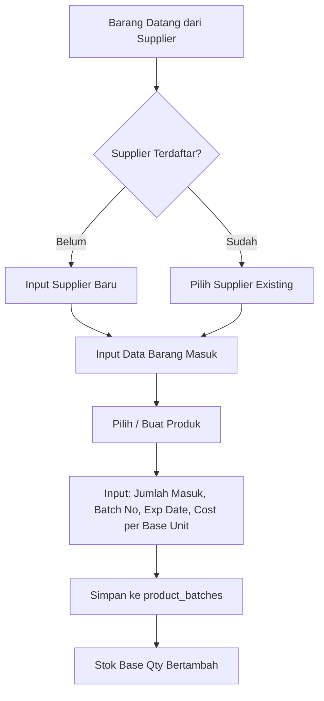
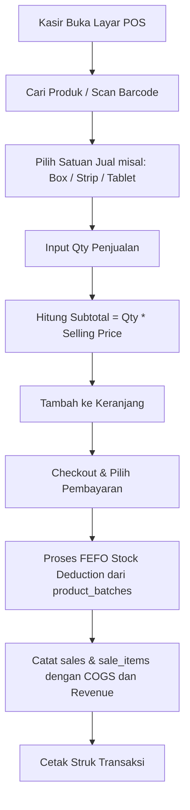

# Master Product Requirements Document (PRD) — POS Apotek

## 1. Overview & Vision
**POS Apotek** adalah aplikasi Point of Sale (Kasir) dan Manajemen Inventori berbasis web yang dirancang khusus untuk apotek. Sistem ini mempermudah proses:
1. **Inbound (Penerimaan Barang dari Supplier)**: Pencatatan barang masuk per batch, tanggal kedaluwarsa (expiry date), dan harga beli (COGS/HPP).
2. **Multi-Satuan (Multi-Unit)**: Penjualan produk dalam berbagai kemasan (misal: Strip, Box, Botol, Pcs, Tablet) dengan pengali (*multiplier*) ke satuan dasar (*base unit*).
3. **Outbound (Kasir / POS)**: Transaksi penjualan cepat dengan pengurangan stok otomatis berbasis metode **FEFO (First Expired, First Out)**.
4. **Laporan & Analytics**: Laporan pendapatan (*revenue*), harga pokok penjualan (*COGS*), laba kotor, dan peringatan kedaluwarsa/stok tipis.

---

## 2. User Roles & Access

| Role | Deskripsi | Akses Menu |
| :--- | :--- | :--- |
| **Admin** | Pengelola apotek / Apoteker | Dashboard, Inventory, Supplier, Reports, Settings, POS (opsional) |
| **Cashier** (Kasir) | Petugas kasir harian | POS (Kasir Transaksi), Dashboard Kasir |

---

## 3. Core Business Flows

### A. Inbound Flow (Barang Masuk / Restock)

### B. Outbound Flow (Penjualan / POS)

---

## 4. Main Menus & Modules

Berikut adalah 6 menu utama aplikasi. Detail spesifikasi tiap menu tersedia di folder `docs/features/`:

| No | Menu | Path Route | File Detail Fitur | Status |
| :--- | :--- | :--- | :--- | :--- |
| 1 | **Dashboard** | `/admin/dashboard` & `/cashier/dashboard` | [01_dashboard.md](./features/01_dashboard.md) | Ready for details |
| 2 | **Inventory** | `/admin/inventory` | [02_inventory.md](./features/02_inventory.md) | Ready for details |
| 3 | **Supplier** | `/admin/suppliers` | [03_supplier.md](./features/03_supplier.md) | Ready for details |
| 4 | **POS** | `/cashier/dashboard` / `/pos` | [04_pos.md](./features/04_pos.md) | Ready for details |
| 5 | **Reports** | `/admin/reports` | [05_reports.md](./features/05_reports.md) | Ready for details |
| 6 | **Settings** | `/settings/*` | [06_settings.md](./features/06_settings.md) | Ready for details |

---

## 5. Database Schema & Suggested Adjustments

Dokumentasi lengkap skema database, relasi, dan usulan penyesuaian (kolom seperti `invoice_number`, `batch_number`, `payment_method`, dsb.) tercatat di:
👉 **[DATABASE_SCHEMA.md](./DATABASE_SCHEMA.md)**

---

## 6. Technical Stack & UI Conventions
- **Backend Framework**: Laravel 11/12 (PHP 8.3+)
- **Frontend Engine**: Inertia.js v3 + React 19 (TypeScript)
- **Styling**: Tailwind CSS v4 (`resources/css/app.css`)
- **Theme Color Tokens**:
  - `primary` (`#0d9488` Teal): Warna aksi utama & identitas apotek.
  - `secondary` (`#10b981` Emerald): Warna sukses & profit.
  - `tertiary` (`#64748b` Slate): Warna teks sekunder & subtil.
  - `neutral` (`#f8fafc` Slate 50): Warna background container & halaman.
- **UI Components**: Radix UI + Lucide React + Sonner (Toast), mengutamakan *reusable components*.
- **Routing**: `@laravel/vite-plugin-wayfinder` (Type-safe route helpers).
- **Responsive Layout**: Desktop Sidebar + Mobile Bottom Navigation Bar (`AppBottomBar`) via `<AppSidebarLayout>`.
- **AI Task Execution Guide**: [docs/AI_DEVELOPMENT_GUIDE.md](./AI_DEVELOPMENT_GUIDE.md).
