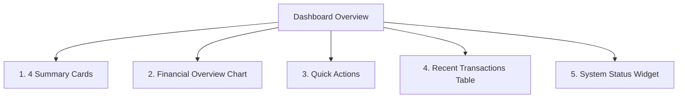

# Feature Specification: 01 — Dashboard

## 1. Ringkasan Fitur
Menu **Dashboard** berfungsi sebagai pusat kontrol operasional dan ringkasan eksekutif apotek. Halaman ini memberikan wawasan instan terkait performa penjualan harian, tren pendapatan, aksi cepat operasional, daftar transaksi terbaru, dan status kesehatan sistem apotek.

---

## 2. Struktur Komponen Dashboard

---

## 3. Rincian Komponen

### A. 4 Summary Cards (Kartu Ringkasan Utama)
Terletak di bagian paling atas dengan layout grid 4 kolom responsif:

1. **Total Penjualan (Total Revenue)**:
   - **Data**: Total nominal rupiah kotor dari tabel `sales.total_revenue` (Hari ini / Bulan ini).
   - **Indikator**: Persentase kenaikan/penurunan dibanding periode sebelumnya (+% / -%).
   - **Ikon**: Shopping Bag / Dollar Sign.
   - **Warna Aksen**: Primary Teal (`#0d9488`).

2. **Total Transaksi (Sales Count)**:
   - **Data**: Total jumlah transaksi/struk yang berhasil dicatat di tabel `sales`.
   - **Indikator**: Rata-rata nilai belanja per pelanggan (*Average Order Value*).
   - **Ikon**: Receipt / Shopping Cart.
   - **Warna Aksen**: Blue / Sky.

3. **Laba Kotor (Gross Profit)**:
   - **Data**: Selisih total pendapatan dikurangi modal: $\sum (\text{total\_revenue} - \text{total\_cogs})$.
   - **Indikator**: Margin keuntungan bersih kotor (misal: 28.5%).
   - **Ikon**: Trending Up / Wallet.
   - **Warna Aksen**: Secondary Emerald (`#10b981`).

4. **Peringatan Stok & Kedaluwarsa (Stock & Expiry Alert)**:
   - **Data**: Total batch yang mendekati kedaluwarsa (< 30/60 hari) + jumlah produk yang stoknya menipis/habis.
   - **Indikator**: Teks peringatan jika ada obat kritis yang butuh tindakan segera.
   - **Ikon**: Alert Triangle / Clock.
   - **Warna Aksen**: Amber / Red Destructive.

---

### B. Financial Overview Chart (Grafik Penjualan)
- **Fungsi**: Visualisasi tren penjualan apotek dalam bentuk grafik area/garis yang elegan dan interaktif.
- **Sumbu X**: Waktu (Hari / Tanggal).
- **Sumbu Y**: Nominal Pendapatan Penjualan (Rupiah).
- **Filter Periode**:
  - `7 Hari Terakhir` (Default)
  - `30 Hari Terakhir`
  - `Bulan Ini`
- **Interaksi**: Hover tooltip menampilkan tanggal, total pendapatan (`revenue`), dan total transaksi pada hari tersebut.

---

### C. Quick Actions (Aksi Cepat)
Tombol shortcut untuk mempercepat tugas operasional harian apoteker dan kasir:
- 🛒 **Buka Kasir (POS)**: Navigasi langsung ke layar kasir penjualan `/pos` atau `/cashier/dashboard`.
- 📦 **Inbound Barang Masuk**: Buka modal/halaman pencatatan penerimaan obat baru dari supplier.
- ➕ **Tambah Produk Baru**: Form cepat pendaftaran master obat baru beserta satuannya.
- 🚚 **Tambah Supplier**: Form modal penambahan distributor / PBF baru.

---

### D. Recent Transactions (Transaksi Penjualan Terbaru)
Tabel yang menampilkan 5 hingga 10 transaksi penjualan terakhir secara *real-time*:
- **Kolom Tabel**:
  1. **No. Transaksi / ID**: Nomor nota/invoice transaksi (misal: `TRX-20260901-001`).
  2. **Waktu**: Jam transaksi (misal: `14:32 WIB` / `5 menit lalu`).
  3. **Kasir**: Nama kasir yang memproses transaksi (`users.name`).
  4. **Jumlah Item**: Total kuantitas barang yang dibeli.
  5. **Total Belanja**: Nominal `total_revenue` dalam format Rupiah (misal: `Rp 85.000`).
  6. **Metode Bayar**: Badge status (Tunai, QRIS, Transfer, Debit).
  7. **Aksi**: Tombol ikon *view detail* atau cetak ulang struk.

---

### E. System Status (Status Operasional Sistem)
Widget status kesehatan dan kesiapan operasional apotek:
- **Status Shift Kasir**: Jumlah kasir yang sedang aktif bertugas hari ini.
- **Integritas Inventori FEFO**: Status sinkronisasi stok dan batch aktif.
- **Peringatan Obat Expired Hari Ini**: Notifikasi jika ada obat yang kedaluwarsa tepat pada hari ini dan harus ditarik dari rak.
- **Status Database & Waktu Server**: Waktu operasional sistem apotek.

---

## 4. Kebutuhan Data & Query Backend
- `App\Services\DashboardService`:
  - `getSummaryMetrics(Carbon $startDate, Carbon $endDate)`
  - `getRevenueChartData(string $period = '7_days')`
  - `getRecentTransactions(int $limit = 5)`
  - `getSystemStatus()`
