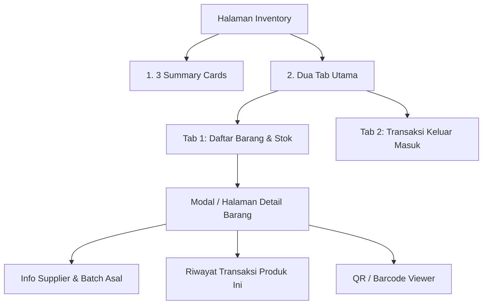

# Feature Specification: 02 — Inventory

## 1. Ringkasan Fitur
Menu **Inventory** mengelola seluruh data master obat/produk, pemantauan stok *real-time*, pelacakan batch kedaluwarsa, kode QR/Barcode produk, serta pencatatan mutasi transaksi barang keluar-masuk.

> [!IMPORTANT]
> **Aturan Wajib Inventory**: Saat membuat produk baru (*Create Product*) atau melakukan penyesuaian/penerimaan stok (*Inbound / Stock Adjustment*), pengguna **wajib memilih supplier** (bisa memilih supplier yang sudah ada atau membuat supplier baru secara langsung).

---

## 2. Struktur Komponen Halaman Inventory

---

## 3. Rincian Komponen

### A. 3 Summary Cards (Kartu Ringkasan Stok)
Terletak di bagian atas halaman inventory:

1. **Total Produk**:
   - Total jumlah master obat/item yang terdaftar di sistem.
   - Ikon: Package / Layers.
   - Aksen: Primary Teal (`#0d9488`).

2. **Total Stok Tersedia**:
   - Akumulasi total kuantitas stok seluruh batch aktif dalam satuan dasar (*Total Base Qty*) beserta estimasi nilai rupiah total aset stok.
   - Ikon: Boxes / Database.
   - Aksen: Secondary Emerald (`#10b981`).

3. **Peringatan Stok & Kedaluwarsa (Low Stock & Expired)**:
   - Jumlah obat dengan stok menipis (di bawah batas minimum) dan batch yang mendekati tanggal kedaluwarsa (< 30/60 hari).
   - Ikon: AlertCircle / ShieldAlert.
   - Aksen: Amber / Red Destructive.

---

### B. Dua Tab Utama (Main Tabs)

#### 🔹 Tab 1: Daftar Barang (Products & Stock List)
Menampilkan katalog seluruh obat beserta stok dan satuan jual:
- **Fitur Pencarian & Barcode**:
  - Input pencarian cepat berdasarkan Nama Obat atau scan Barcode/QR.
  - Tampilan kode QR / Barcode produk yang dapat dicetak (*print label*).
- **Kolom Tabel Barang**:
  1. **QR / Barcode**: Kode visual dan nomor barcode unik.
  2. **Nama Produk**: Nama obat dan kategori/jenis obat.
  3. **Satuan Dasar (*Base Unit*)**: Satuan terkecil (misal: `tablet`, `botol`, `kapsul`).
  4. **Pilihan Satuan Jual & Harga**: Badge satuan jual beserta harga (misal: `Strip @ Rp 15.000 (x10)`, `Box @ Rp 140.000 (x100)`).
  5. **Total Stok Sisa**: Total `base_qty` dari seluruh batch aktif (dengan konversi visual, contoh: `250 tablet (25 strip)`).
  6. **Status Stok**: Badge Aman (Hijau), Menipis (Kuning), Habis (Merah).
  7. **Aksi**: 
     - 👁️ **Lihat Detail** (Membuka detail supplier, batch, dan log transaksi barang ini).
     - ✏️ **Edit Produk**.
     - 🗑️ **Hapus / Nonaktifkan Produk**.

- **Tombol "Tambah Produk Baru"**:
  - Modal / Form dengan input:
    - **Pilih Supplier (Wajib)**: Dropdown supplier existing atau tombol "+ Tambah Supplier Baru".
    - **Nama Produk & Barcode/QR**: Input barcode atau generate otomatis QR/Barcode unik.
    - **Satuan Dasar (*Base Unit*)**: Misal `tablet`.
    - **Satuan Jual Bertingkat (`product_units`)**: Multiplier dan Harga Jual (misal: `Strip` x10 = Rp 15.000).
    - **Stok Awal & Batch Inbound**: Jumlah masuk, Nomor Batch, Tanggal Kedaluwarsa, Harga Beli per Base Unit (`cost_per_base_unit`).

---

#### 🔹 Tab 2: Transaksi Keluar Masuk (Inbound & Outbound Log)
Menyajikan riwayat pergerakan stok secara kronologis (keluar-masuk):
- **Filter Log**: Semua, Hanya Barang Masuk (Inbound), Hanya Barang Keluar (Penjualan Kasir).
- **Kolom Tabel Mutasi**:
  1. **Waktu / Tanggal**: Waktu pencatatan mutasi.
  2. **Jenis Mutasi**: 
     - 🟢 **Barang Masuk (Inbound)**: Penerimaan dari supplier.
     - 🔴 **Barang Keluar (Outbound)**: Penjualan kasir POS / Penyesuaian.
  3. **Nama Produk**: Obat terkait dan Barcode.
  4. **Supplier / Kasir**: Nama Supplier asal (jika Inbound) atau Nama Kasir (jika Outbound).
  5. **No. Batch & Exp Date**: Batch yang terisi atau terpotong.
  6. **Jumlah (Qty)**: Qty satuan dasar (`+50 tablet` atau `-10 tablet`).
  7. **Biaya / Nilai**: Harga beli modal (Inbound) atau Total harga jual (Outbound).

---

### C. Modal / Halaman Detail Barang (Product Detail View)
Ketika tombol **"Lihat Detail"** pada suatu barang diklik, akan muncul tampilan komprehensif yang memuat:

1. **Header Info & QR Code**:
   - Nama produk, satuan dasar, dan tampilan QR/Barcode yang siap di-scan atau diunduh.
   - Daftar satuan jual dan harga aktif.

2. **Daftar Pasokan Supplier & Batch Aktif**:
   - Menampilkan barang ini dipasok dari **supplier mana saja**:
     - Kolom: Nama Supplier, Kontak Supplier, Nomor Batch, Tanggal Diterima, Tanggal Kedaluwarsa (*Expiry Date*), Sisa Stok Base Qty, Harga Modal Beli (`cost_per_base_unit`).

3. **Riwayat Transaksi Khusus Barang Ini**:
   - Log mutasi khusus produk ini:
     - Kapan barang masuk dari Supplier A (+Qty).
     - Kapan barang terjual di Kasir B (-Qty).
     - Sisa stok akhir setelah mutasi.

4. **Aksi Cepat di Detail Barang**:
   - **Tambah Stok Baru (Inbound dari Supplier)**: Form cepat menambah batch baru untuk produk ini (wajib pilih supplier).
   - **Cetak Label QR/Barcode**: Cetak barcode untuk ditempel pada rak atau kemasan obat.

---

## 4. Kebutuhan Data & Skema Backend
- `App\Services\InventoryService`:
  - `getInventorySummary()`: Menghasilkan 3 KPI summary cards.
  - `getProductsList(Request $request)`: Query produk dengan total stok teragregasi dari `product_batches`.
  - `getProductDetail(int $productId)`: Mengambil relasi `units`, `batches.supplier`, dan riwayat transaksi.
  - `getStockMutations(Request $request)`: Log gabungan penerimaan batch dan item penjualan `sale_items`.
  - `storeProduct(StoreProductRequest $request)`: Validasi pembuatan produk + pembuatan batch awal dengan `supplier_id` wajib.
  - `adjustStock(AdjustStockRequest $request)`: Inbound / penambahan batch baru dengan `supplier_id` wajib.
