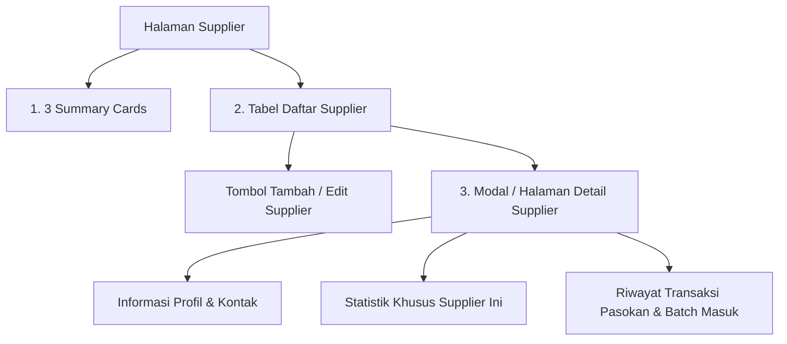

# Feature Specification: 03 — Supplier

## 1. Ringkasan Fitur
Menu **Supplier** berfungsi untuk mengelola data rekanan distributor, Pedagang Besar Farmasi (PBF), atau pemasok obat. Modul ini melacak performa pengadaan barang, total variasi produk yang dipasok (SKU), total pengeluaran belanja (*Total Spend*), serta riwayat transaksi penerimaan barang dari masing-masing supplier.

---

## 2. Struktur Komponen Halaman Supplier

---

## 3. Rincian Komponen

### A. 3 Summary Cards (Kartu Ringkasan Pengadaan)
Terletak di bagian atas halaman supplier:

1. **Total SKU (Total Variasi Produk)**:
   - **Data**: Total jumlah produk/SKU unik yang pernah dipasok oleh supplier ke apotek.
   - **Ikon**: PackageCheck / Layers.
   - **Warna Aksen**: Primary Teal (`#0d9488`).

2. **Total Spend (Total Pengeluaran Belanja)**:
   - **Data**: Akumulasi total nominal rupiah biaya pengadaan obat dari seluruh batch yang diterima: $\sum (\text{product\_batches.base\_qty} \times \text{product\_batches.cost\_per\_base\_unit})$.
   - **Ikon**: DollarSign / Coins.
   - **Warna Aksen**: Secondary Emerald (`#10b981`).

3. **Last Order Date (Tanggal Pengadaan Terakhir)**:
   - **Data**: Tanggal dan waktu transaksi penerimaan barang masuk (*inbound*) terakhir dari supplier.
   - **Ikon**: Calendar / Clock.
   - **Warna Aksen**: Blue / Indigo.

---

### B. Tabel Daftar Supplier (Supplier List)
Menampilkan daftar seluruh distributor/pemasok apotek:
- **Fitur Filter & Pencarian**:
  - Input pencarian cepat berdasarkan Nama Supplier atau Nomor Telepon.
- **Kolom Tabel**:
  1. **Nama Supplier**: Nama perusahaan PBF atau nama kontak distributor.
  2. **Nomor Telepon**: Kontak telepon/WhatsApp aktif.
  3. **Total SKU Dipasok**: Jumlah varian obat berbeda yang disuplai oleh supplier ini.
  4. **Total Spend**: Total akumulasi nilai belanja apotek ke supplier ini (Rupiah).
  5. **Order Terakhir (Last Order)**: Tanggal pasokan terakhir diterima.
  6. **Aksi**:
     - 👁️ **Detail**: Membuka halaman/modal profil dan riwayat transaksi supplier ini.
     - ✏️ **Edit**: Mengubah nama atau kontak telepon supplier.
     - 🗑️ **Hapus**: Menghapus supplier (dilarang hapus jika supplier sudah memiliki relasi data batch obat aktif).

- **Tombol "+ Tambah Supplier Baru"**:
  - Membuka modal dialog form cepat:
    - **Nama Supplier** (Wajib): Nama PBF/Distributor.
    - **Nomor Telepon** (Opsional/Valid): No telepon/WhatsApp sales.

---

### C. Detail Supplier (Supplier Detail View)
Ketika tombol **"Detail"** pada salah satu supplier diklik:

1. **Header & Informasi Kontak**:
   - Nama Supplier, No. Telepon / Tombol Chat WhatsApp langsung.
   - Tombol cepat: "Terima Barang / Inbound dari Supplier Ini".

2. **Ringkasan Khusus Supplier Ini (Mini KPI)**:
   - Total variasi SKU yang disuplai oleh supplier ini.
   - Total nominal belanja (*Spend*) ke supplier ini.
   - Tanggal order pertama & order terakhir.

3. **Riwayat Transaksi & Batch Masuk (Supplier Transactions)**:
   - Tabel menampilkan seluruh riwayat pasokan barang masuk yang bersumber dari supplier ini (`product_batches`):
     - **Tanggal / Waktu**: Tanggal penerimaan barang.
     - **Nama Produk**: Nama obat dan barcode.
     - **Nomor Batch**: No. Lot / Batch fisik kemasan.
     - **Tanggal Kedaluwarsa (*Expiry Date*)**: Tanggal expired batch.
     - **Jumlah Diterima**: Kuantitas yang masuk (satuan dasar).
     - **Harga Beli Satuan**: `cost_per_base_unit`.
     - **Total Nilai Pasokan**: $\text{Base Qty} \times \text{Cost per Base Unit}$.

---

## 4. Kebutuhan Data & Query Backend
- `App\Services\SupplierService`:
  - `getSupplierMetrics()`: Menghasilkan 3 summary cards (Total SKU, Total Spend, Last Order Date).
  - `getSuppliersList(Request $request)`: Query daftar supplier dengan kalkulasi agregasi `batches_count`, `total_spend`, dan `last_order_date`.
  - `getSupplierDetail(int $supplierId)`: Profil supplier beserta relasi `product_batches.product` yang diurutkan dari transaksi terbaru (`created_at DESC`).
  - `storeSupplier(StoreSupplierRequest $request)`: Validasi dan penyimpanan supplier baru.
  - `updateSupplier(UpdateSupplierRequest $request, Supplier $supplier)`: Pembaruan data supplier.
