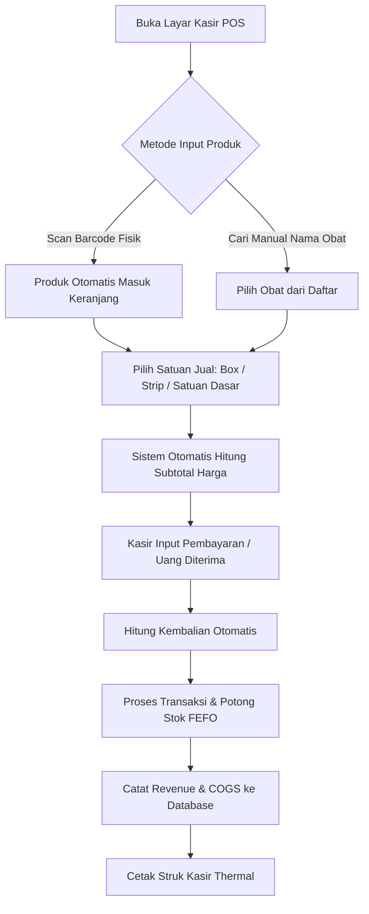

# Feature Specification: 04 — POS (Point of Sale / Kasir)

## 1. Ringkasan Fitur
Menu **POS (Point of Sale)** adalah antarmuka kasir apotek yang dirancang untuk kecepatan dan akurasi tinggi. Kasir dapat memindai barcode produk secara langsung atau mencari nama obat, memilih kemasan penjualan (per **Box**, per **Strip**, atau per **Satuan Dasar / Eceran**), dan sistem secara otomatis menghitung total harga serta memotong stok obat berdasarkan metode **FEFO (First Expired, First Out)**.

---

## 2. Alur Transaksi Kasir (User Flow)

---

## 3. Rincian Komponen Antarmuka Kasir

### A. Panel Input Barcode & Pencarian Cepat
- **Barcode Scanner Support (Prioritas Utama)**:
  - Input field barcode selalu berstatus *auto-focus*.
  - Saat kasir memindai barcode fisik pada kemasan obat, sistem langsung mencocokkan `products.barcode`, memuat satuan default, dan langsung memasukkannya ke dalam keranjang belanja tanpa perlu klik atau cari manual.
  - Jika barcode yang sama di-scan berulang kali, jumlah (*Qty*) produk di keranjang otomatis bertambah (+1).
- **Pencarian Teks Manual**:
  - Input pencarian live berdasarkan nama obat dengan preview stok tersisa dan harga satuan.
- **Katalog Produk Cepat (Quick Grid)**:
  - Tombol-tombol kartu obat *fast-moving* / OTC yang paling sering dibeli konsumen.

---

### B. Keranjang Belanja & Pemilihan Satuan Dinamis
Tabel keranjang transaksi dengan fitur kalkulasi otomatis:
- **Daftar Kolom Keranjang**:
  1. **Nama Obat & Barcode**: Nama obat beserta indikator stok total yang tersedia.
  2. **Pilihan Satuan Jual (`product_units`)**:
     - Dropdown / Toggle pilihan satuan (misal: **Box**, **Strip**, atau **Tablet/Pcs**).
     - Saat kasir mengganti satuan (misal dari *Strip* ke *Box*), harga satuan dan subtotal otomatis berubah seketika.
  3. **Jumlah Beli (Qty)**:
     - Tombol cepat `-` dan `+` atau ketik langsung angka kuantitas.
  4. **Harga Satuan**: Nilai `product_units.selling_price`.
  5. **Subtotal Harga**: Otomatis terhitung $\text{Subtotal} = \text{Qty} \times \text{Harga Satuan Jual}$.
  6. **Aksi**: Tombol hapus item dari keranjang.

- **Validasi Stok Real-Time**:
  - Sistem otomatis mengecek apakah total kebutuhan dalam satuan dasar ($\text{Qty} \times \text{Multiplier}$) tersedia di `product_batches`. Jika stok tidak cukup, sistem menampilkan peringatan dan mencegah checkout melebihi stok.

---

### C. Ringkasan Total & Pembayaran (Checkout Panel)
Terletak di sisi kanan layar kasir:
- **Display Grand Total**: Total nominal belanja dalam font besar dan kontras tinggi.
- **Pilihan Metode Pembayaran**:
  - 💵 **Tunai (Cash)**: Input uang diterima dengan tombol nominal cepat (Uang Pas, 10.000, 20.000, 50.000, 100.000).
  - 📱 **QRIS**: Menampilkan kode QRIS dinamis/statis.
  - 💳 **Transfer Bank / Kartu Debit**.
- **Display Kembalian (*Change Amount*)**:
  - Dihitung otomatis: $\text{Kembalian} = \text{Uang Diterima} - \text{Total Belanja}$.

---

### D. Engine Backend: Pemotongan Stok FEFO & COGS
Saat tombol **"Selesaikan Transaksi"** ditekan:
1. **Validasi & Lock Transaksi**: Membuka `DB::transaction()`.
2. **FEFO Deduction**:
   - Sistem mengambil batch aktif produk tersebut dari `product_batches` yang memiliki `base_qty > 0`, diurutkan dari yang paling dekat kedaluwarsa (`ORDER BY expiry_date ASC`).
   - Stok terpotong sesuai kuantitas satuan dasar yang dibeli.
3. **Kalkulasi COGS (Harga Pokok Penjualan)**:
   - Total modal dihitung dari harga beli `cost_per_base_unit` pada batch-batch yang terpotong.
4. **Pencatatan ke Database**:
   - `sales`: `user_id` (kasir), `total_revenue`, `total_cogs`, `created_at`.
   - `sale_items`: `sale_id`, `product_id`, `unit_id`, `qty`, `total_price`, `total_cogs`.

---

### E. Cetak Struk Kasir (Thermal Receipt)
- Format cetak responsif untuk printer kasir thermal ukuran **58mm** dan **80mm**.
- Komponen Struk:
  - Header: Nama Apotek, Alamat, No. Telp, No. Nota Transaksi, Tanggal/Jam, Kasir.
  - Body: Daftar Item (Nama Obat, Satuan Jual, Qty, Harga, Subtotal).
  - Footer: Total Belanja, Bayar, Kembalian, Metode Bayar, Ucapan terima kasih / "Semoga Lekas Sembuh".

---

## 4. Kebutuhan Data & Service Backend
- `App\Services\PosSaleService`:
  - `findProductByBarcode(string $barcode)`: Pencarian cepat produk dan seluruh satuannya.
  - `searchProducts(string $keyword)`: Pencarian teks produk aktif.
  - `processCheckout(CheckoutRequest $request, int $userId)`: Transaksi penjualan lengkap dengan FEFO batch deduction, perhitungan COGS, dan pembentukan struk.
