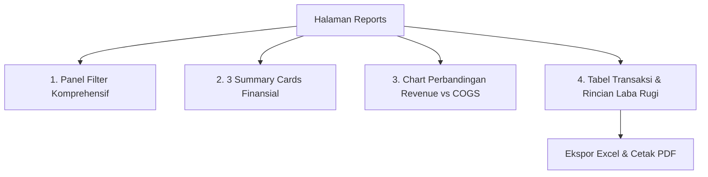

# Feature Specification: 05 — Reports (Laporan)

## 1. Ringkasan Fitur
Menu **Reports** adalah pusat analitik keuangan dan profitabilitas apotek. Modul ini menyajikan ringkasan performa finansial, kalkulasi laba bersih yang memperhitungkan Harga Pokok Penjualan (COGS) dan Pajak (PPN), grafik perbandingan Revenue vs COGS, serta filter laporan yang sangat komprehensif.

---

## 2. Struktur Komponen Halaman Reports

---

## 3. Rincian Komponen

### A. Panel Filter Komprehensif (Comprehensive Filters)
Terletak di bagian atas untuk menyaring data laporan secara dinamis:
- 📅 **Rentang Waktu (Date Range Picker)**:
  - Pilihan Cepat: `Hari Ini`, `7 Hari Terakhir`, `Bulan Ini`, `Bulan Lalu`, `Tahun Ini`.
  - Kustom: Dari tanggal `[Start Date]` sampai tanggal `[End Date]`.
- 💊 **Filter Produk Tertentu**:
  - Pilihan: `Semua Produk` atau pilih produk spesifik dengan pencarian (*searchable dropdown*).
- 👤 **Filter Kasir**:
  - Pilihan: `Semua Kasir` atau pilih akun kasir tertentu (`users.id`).
- 💳 **Filter Metode Pembayaran**:
  - Pilihan: `Semua Metode`, `Tunai (Cash)`, `QRIS`, `Transfer`, `Debit`.
- 🔄 **Tombol Aksi Filter**:
  - Tombol "Terapkan Filter" dan "Reset Filter".

---

### B. 3 Summary Cards (Ringkasan Keuangan Utama)
Metrik yang otomatis terkalkulasi berdasarkan hasil filter aktif:

1. **Total Revenue (Total Pendapatan)**:
   - **Data**: Akumulasi nilai kotor seluruh transaksi penjualan: $\sum (\text{sales.total\_revenue})$.
   - **Ikon**: DollarSign / TrendingUp.
   - **Warna Aksen**: Primary Teal (`#0d9488`).

2. **Total COGS (Total HPP / Modal Barang)**:
   - **Data**: Akumulasi modal beli obat dari batch yang terjual: $\sum (\text{sales.total\_cogs})$.
   - **Ikon**: Archive / Layers.
   - **Warna Aksen**: Slate / Amber.

3. **Net Profit (Laba Bersih Setelah Pajak)**:
   - **Data**: Keuntungan bersih yang telah dikurangi modal dan pajak:
     $$\text{Net Profit} = \text{Total Revenue} - \text{Total COGS} - \text{Pajak (Tax)}$$
   - **Indikator**: Persentase margin laba bersih terhadap omzet (misal: `Margin: 24.8%`).
   - **Ikon**: Wallet / CheckCircle.
   - **Warna Aksen**: Secondary Emerald (`#10b981`).

---

### C. Chart Perbandingan Revenue vs COGS
- **Fungsi**: Visualisasi grafik batang ganda / area bertingkat (*Double Bar / Multi-line Area Chart*) yang memperlihatkan tren Pendapatan (*Revenue*) berdampingan dengan Modal (*COGS*) dari hari ke hari atau bulan ke bulan.
- **Sumbu X**: Periode Waktu (Tanggal / Bulan).
- **Sumbu Y**: Nominal Rupiah.
- **Legend**:
  - 🟦 **Revenue (Pendapatan)**: Warna Teal / Blue.
  - 🟧 **COGS (Modal HPP)**: Warna Slate / Amber.
  - 🟩 **Area Margin (Selisih Laba)**: Wilayah di antara garis Revenue dan COGS.
- **Interaksi**: Hover tooltip interaktif yang menampilkan rincian: Tanggal, Revenue, COGS, Estimasi Pajak, dan Net Profit harian.

---

### D. Tabel Rincian Transaksi & Laba Rugi
Menampilkan daftar transaksi penjualan sesuai kriteria filter:
- **Kolom Tabel**:
  1. **No. Nota / ID**: Nomor transaksi struk (misal: `TRX-20260901-001`).
  2. **Tanggal & Waktu**: Waktu transaksi diproses.
  3. **Kasir**: Nama kasir penanggung jawab.
  4. **Rincian Item Produk**: Nama obat yang dibeli, satuan jual, dan kuantitas.
  5. **Metode Pembayaran**: Badge (Tunai / QRIS / Transfer / Debit).
  6. **Revenue (Omzet)**: Nominal pendapatan kotor (Rp).
  7. **COGS (Modal)**: Nominal HPP barang (Rp).
  8. **Pajak (Tax)**: Estimasi nominal pajak yang dikenakan (Rp).
  9. **Net Profit (Laba Bersih)**: Selisih $\text{Revenue} - \text{COGS} - \text{Pajak}$.
- **Footer Summary (Akumulasi Total Baris)**:
  - Baris total paling bawah yang menjumlahkan seluruh kolom Revenue, COGS, Pajak, dan Net Profit dari data yang ditampilkan.

---

### E. Fitur Ekspor Laporan
- 📊 **Ekspor Excel (.xlsx / .csv)**: Mengunduh data laporan lengkap siap olah untuk pembukuan akuntansi.
- 🖨️ **Cetak Laporan / Export PDF**: Format cetak laporan rapi dengan kop apotek, periode laporan, dan tanda tangan penanggung jawab.

---

## 4. Kebutuhan Data & Query Backend
- `App\Services\ReportService`:
  - `getFinancialSummary(ReportFilterDTO $filter)`: Menghitung Total Revenue, Total COGS, Pajak, dan Net Profit.
  - `getRevenueVsCogsChart(ReportFilterDTO $filter)`: Data time-series harian/bulanan untuk grafik.
  - `getFilteredTransactions(ReportFilterDTO $filter, int $perPage = 25)`: Query transaksi `sales` beserta relasi `sale_items.product`, `sale_items.unit`, `user`.
  - `exportToExcel(ReportFilterDTO $filter)`: Stream download file spreadsheet.
