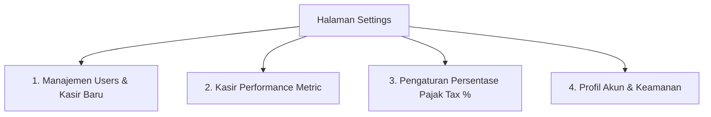

# Feature Specification: 06 — Settings (Pengaturan)

## 1. Ringkasan Fitur
Menu **Settings** mengelola akun pengguna apotek (Admin dan Kasir), pemantauan performa kasir (*Cashier Performance*), serta konfigurasi global seperti persentase pajak (**Tax %**) yang otomatis terhubung ke perhitungan transaksi kasir POS dan laporan keuangan di menu Reports.

---

## 2. Struktur Komponen Halaman Settings

---

## 3. Rincian Komponen

### A. Manajemen Users & Kasir Baru (User Management)
- **Tabel Daftar Pengguna Terdaftar**:
  - Kolom: Nama User, Email / Username, Role (Badge: `Admin` / `Cashier`), Tanggal Dibuat, Status Akun (Aktif / Nonaktif), Aksi (Edit, Reset Password, Hapus/Nonaktifkan).
- **Tombol "+ Buat Kasir Baru"**:
  - Membuka modal dialog form:
    - **Nama Lengkap Kasir**: (misal: "Budi Santoso")
    - **Email / Username**: Untuk login di `/login-cashier`
    - **Password**: Password awal akun kasir
    - **Konfirmasi Password**
    - **Role**: Otomatis terset ke `cashier` (atau pilihan `admin`/`cashier`)
  - **Feedback**: Notifikasi toast sukses `toast.success("Akun kasir berhasil dibuat!")` dan langsung muncul di tabel.

---

### B. Performa Kasir (Cashier Performance)
Bagian khusus yang menampilkan metrik kontribusi dan keaktifan masing-masing kasir:
- **Tabel Metrik Performa Kasir**:
  1. **Nama Kasir**: Foto profil / Inisial dan Nama.
  2. **Total Transaksi (Sales Count)**: Jumlah nota/struk yang berhasil diproses oleh kasir ini.
  3. **Total Omzet (Total Revenue)**: Akumulasi nominal rupiah penjualan yang dihasilkan oleh kasir ini.
  4. **Rata-rata Transaksi (AOV)**: Nilai rata-rata rupiah per transaksi ($\text{Total Revenue} / \text{Total Transaksi}$).
  5. **Transaksi Terakhir**: Tanggal dan jam terakhir kasir memproses transaksi.
  6. **Status**: Badge Aktif / Sedang Bertugas.

---

### C. Pengaturan Persentase Pajak (Tax Settings)
Konfigurasi pajak apotek yang langsung terintegrasi secara dinamis ke seluruh sistem:
- **Form Input Pajak**:
  - **Persentase Pajak (*Tax Rate %*)**: Input angka desimal (contoh: `11%` untuk PPN atau `0%` jika bebas pajak).
  - **Status Pajak**: Toggle Aktifkan / Nonaktifkan Pajak pada transaksi POS.
  - **Keterangan Pajak di Struk**: Label teks yang dicetak pada struk (contoh: `PPN (11%)`).
- **Otomatisasi Integrasi**:
  - 🛒 **Ke Menu POS**: Saat kasir memproses transaksi, sistem otomatis menghitung:
    $$\text{Tax Amount} = \text{Subtotal} \times \frac{\text{Tax Rate}}{100}$$
  - 📊 **Ke Menu Reports**: Pajak yang tersimpan otomatis menjadi faktor pengurang dalam perhitungan **Net Profit**:
    $$\text{Net Profit} = \text{Revenue} - \text{COGS} - \text{Tax}$$

---

### D. Profil Pengguna & Keamanan
- **Profil Saya (`/settings/profile`)**: Update nama, email, dan foto profil pengguna yang sedang login.
- **Keamanan & Password (`/settings/security`)**: Ganti password akun saat ini.
- **Preferensi Tema (`/settings/appearance`)**: Pilihan tema Light, Dark, atau System.

---

## 4. Kebutuhan Data & Skema Backend
- `settings` / `app_configs` (atau disimpan di file konfigurasi / tabel key-value):
  - `tax_percentage` (default: 11.00)
  - `tax_is_active` (boolean)
- `App\Services\SettingService`:
  - `getUsersWithPerformance()`: Mengambil daftar user beserta agregasi `sales_count` dan `total_revenue`.
  - `storeUser(CreateUserRequest $request)`: Validasi dan pembuatan akun kasir baru.
  - `updateTaxSetting(TaxSettingRequest $request)`: Menyimpan persentase pajak aktif.
  - `getTaxRate()`: Helper untuk digunakan oleh `PosSaleService` dan `ReportService`.
