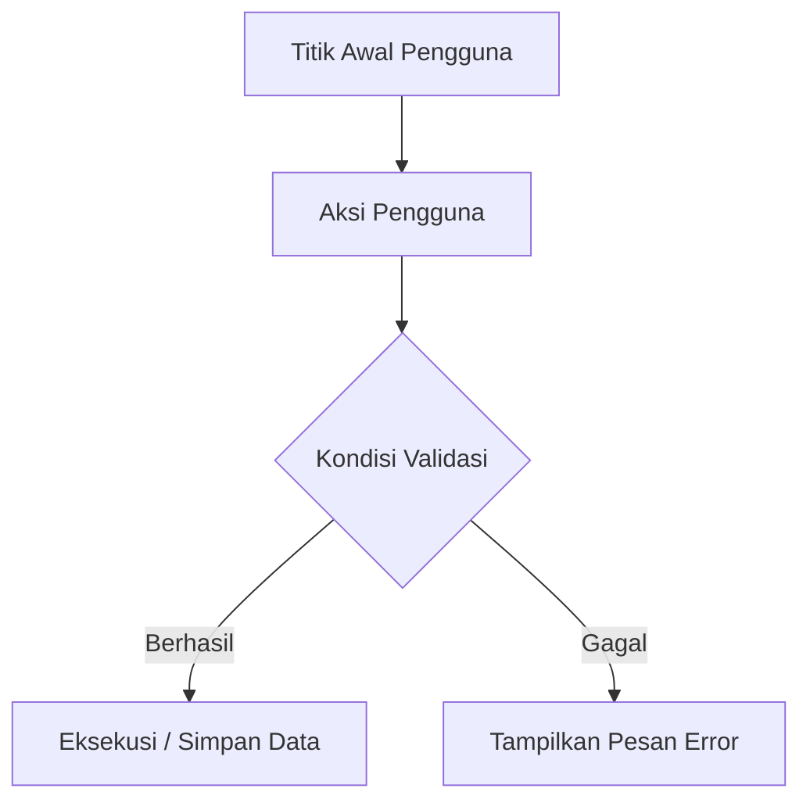

# Feature Specification: [Nama Modul / Fitur]

## 1. Ringkasan & Tujuan Fitur
[Jelaskan secara singkat apa tujuan fitur ini, siapa yang menggunakannya, dan masalah apa yang diselesaikannya.]

---

## 2. Alur Pengguna (User Flow)

---

## 3. Komponen Antarmuka & Interaksi (UI / UX)
- **Tampilan Desktop & Mobile**: [Jelaskan layout, tabel, dialog/modal, atau form input]
- **Elemen Interaktif**: [Tombol aksi, filter dropdown, live search, shortcut keyboard]
- **State Kosong / Loading**: [Bagaimana tampilan jika belum ada data]

---

## 4. Kebutuhan Data & Skema Database
- **Tabel Terkait**:
  - `nama_tabel_1`: [kolom baru atau kolom terkait]
  - `nama_tabel_2`: [kolom baru atau kolom terkait]
- **Aturan Validasi Form**:
  - `field_a`: Wajib diisi, tipe string, max 255
  - `field_b`: Wajib diisi, tipe integer, min 1

---

## 5. Logika Backend & Business Rules
1. [Langkah logika 1]
2. [Langkah logika 2]
3. [Langkah logika 3]

---

## 6. Kriteria Keberhasilan (Acceptance Criteria)
- [ ] Pengguna dapat mengakses halaman melalui rute `[route_name]`
- [ ] Form dapat menyimpan data dengan feedback toast sukses
- [ ] Validasi error muncul jika input tidak sesuai
- [ ] Tampilan responsif di desktop dan mobile
